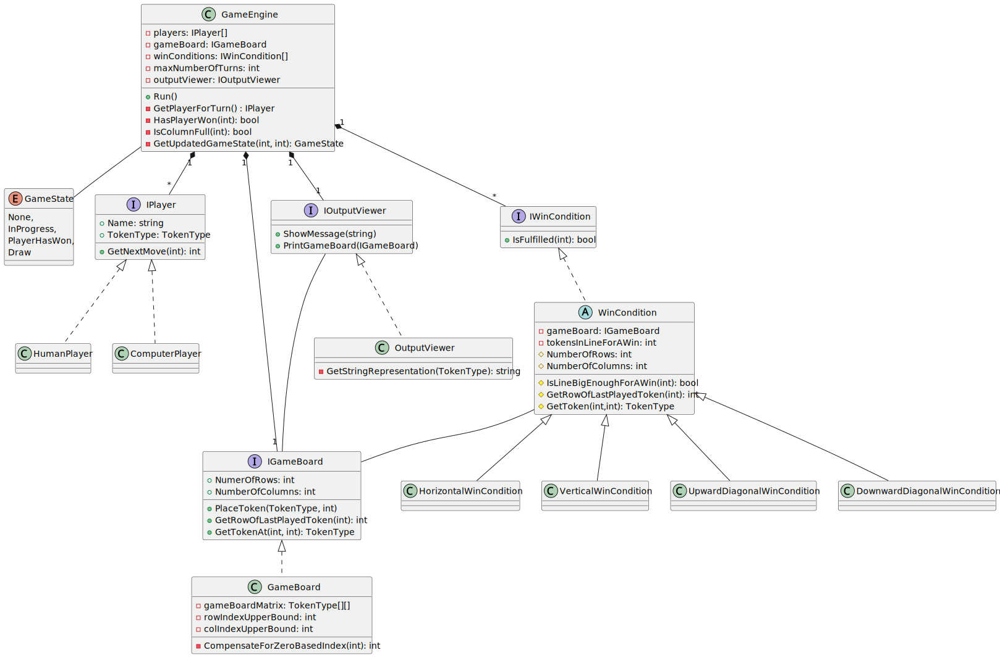

# ConnectFour
Connect Four is a game in which two players strategically (or not ;)) drop tokens in a `6 * 7` board with the aim to get 4 tokens of the same colour in a line (either horizontally, vertically or diagonally). It is a special case of the more general `m,n,k`-game where two players try to get `k` tokens in a line on an `m * n` board.

## Dependencies
See instructions on how to install (open source) .NET on Linux [here](https://learn.microsoft.com/en-us/dotnet/core/install/linux) (can be installed via the regular package manager for popular distros such as Fedora and Ubuntu).

## How to View
You can use VSCode or VSCodium (open source) for easy viewing of the solution (or just use Github).

## How to Run
From the command-line, assuming you're in the root folder of this project:
`dotnet run --project ConnectFour/`

To run the unit tests execute:
`dotnet test`

## Class Diagram

## Work to be Done
I've spent about 10 hours in total and there's always room for improvement.

### Code Improvements
- Wrap the Console in an input class to allow for different input methods for a human player
- Make constants configurable via a text-based file (e.g. JSON).
- Improve code coverage and use a mocking framework (GameEngine and other classes).
- Currently input parameters for constructors and methods are not validated, allowing for potential bugs when the input is not as expected (e.g., `null` values or indices out of bounds).
- Add dependency injection framework.
- Introduce a Token class; that would make it easier to:
  - Get the coordinates of where it was placed (especially the row); don’t need to get things after that.
- Rewrite the whole thing in a sane (i.e., non-Microsoft) language like Python. Using numpy could simplify some things such as checking the win condition by using slicing.

## Features
- Implement a more competitive AI.
- Implement a *proper* UI